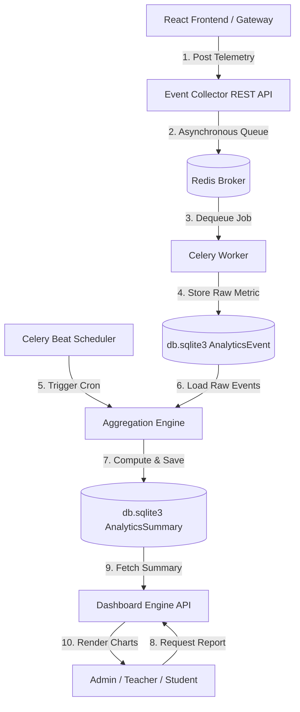

# Software Architecture Specification: Enterprise Analytics Platform

This specification details the end-to-end design, data models, services layers, and module analytics schemas for the BrahmaVidya Enterprise Analytics Platform.

---

## 1. System Overview & Architecture Diagram

The platform uses a layered telemetry architecture to collect, aggregate, and display analytics metrics with minimal database performance impact:

---

## 2. Platform Core Engines

### 1. Event Collector
Exposes a lightweight REST endpoint `POST /api/v1/analytics/collect/` to receive events from clients.
* **Non-blocking Dispatch:** The view receives payloads (e.g. user session logs, video playback progress) and immediately offloads processing to a Celery background task:
  `track_event_task.delay(user_id, metric_name, value, context_data)`
* **IP/Browser Parsing:** Automatically resolves geographic data (country/city) and user device metadata (browser, OS) from request headers.

### 2. Metrics & Aggregation Engine
Runs periodic calculations using a Celery scheduler to compile raw events into structured stats:
* **Hourly Aggregations:** Computes active session rates, dwell times, and transaction values.
* **Daily Summary Tables:** Stores timeseries metrics in a summary table (`analytics_summaries`) to keep dashboard loads fast.

### 3. Dashboard Engine
Exposes API endpoints to return charts and metrics formatted for the React frontend:
* **Chart Data format:** Returns arrays formatted for React charting libraries (e.g. Recharts):
  `{"label": "Mon", "users": 140, "revenue": 1200}`
* **Caching:** Cache computed analytics results for 15 minutes using Django cache backends to reduce database queries.

### 4. Export & Report Engine
Enables scheduled reports and file downloads (CSV, PDF, JSON):
* **Scheduled Reports:** Celery tasks compile weekly reports and email them to administrators.
* **Data Export:** Exports audit trails and transaction history records.

---

## 3. Role-Based Dashboards

Dashboard widgets and metrics are scoped to user roles:

| User Role | Dashboard Scope | Primary Metrics Displayed |
|---|---|---|
| **Super Admin** | Platform-Wide | MRR, active sessions, CPU usage, system error rates, API latencies. |
| **Organization / Institute** | Portal-Specific | Student enrollment numbers, revenue shares, certificate issuances. |
| **Teacher** | Classroom-Specific | Course progression rates, quiz scores, assignment submissions. |
| **Student** | Personal Portal | Study time, badges earned, course progress, AI tokens used. |

---

## 4. Module-Specific Analytics Integration

The platform tracks and aggregates metrics across all ecosystem modules:

### 1. LMS Analytics
* **Tracking:** Event triggers on course enrollments, lesson starts, quiz completions, and assignment submissions.
* **Aggregates:** Progression curves, average quiz scores, and course completion rates.

### 2. CMS Analytics
* **Tracking:** Page views, tutorial completions, forum posts, and comment counts.
* **Aggregates:** Page popularity ranks, active forum topics, and user engagement metrics.

### 3. Wallet & Marketplace Analytics
* **Tracking:** Payments, wallet transfers, bookstore purchases, and refund requests.
* **Aggregates:** Monthly recurring revenue (MRR), total sales, refund rates, and billing cycles.

### 4. AI Analytics
* **Tracking:** AI conversation counts, messages sent, response times, and feedback ratings.
* **Aggregates:** Total token usage counts and average assistant response speeds.

### 5. Search Analytics
* **Tracking:** Keywords searched, result counts, and result click positions.
* **Aggregates:** Click-through rates (CTR) and popular search terms.

### 6. SEO Analytics
* **Tracking:** Crawl counts, sitemap requests, and page metadata hits.
* **Aggregates:** Search engine crawler activity.

### 7. Notification Analytics
* **Tracking:** Notifications broadcasted, in-app open events, and email delivery rates.
* **Aggregates:** Open rates and notification delivery logs.

### 8. Gateway Analytics
* **Tracking:** API request paths, HTTP response codes, and request durations.
* **Aggregates:** Request failure rates and page load times.
