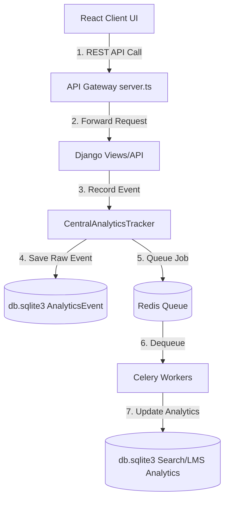

# Sprint 18 — Enterprise Analytics Platform: Architecture Analysis

This document provides a comprehensive analysis of the existing BrahmaVidya Galaxy architecture to identify analytics integration opportunities, reusable system structures, risks, and proposed design metrics.

---

## 1. Complete Architecture Analysis

The BrahmaVidya Galaxy platform uses a distributed, multi-tier runtime architecture:
1. **Frontend (React/Vite):** Renders views, intercepts user events (clicks, navigations, playbacks), and forwards telemetry events via REST APIs.
2. **API Gateway (Node.js/Express):** Handles load balancing, rate limiting, and forwards JWT request signatures to the backend, propagating request tracking via standard `X-Request-ID` headers.
3. **Application Server (Django):** Runs core service logic, resolves database transactions, manages Django signals, and triggers Celery background workers.
4. **Database (SQLite/JSON):** Uses a SQLite database (`db.sqlite3`) for relational tables and local file-backed JSON stores (`admin_store.json`, `portfolio_store.py` files) for schemas with low read-write volumes.
5. **Worker Queue (Celery/Redis):** Handles long-running calculations asynchronously to avoid impacting request latency.

---

## 2. Existing Reusable Models

Several existing database models can be reused or extended for the Enterprise Analytics Platform:
* `AnalyticsEvent` ([control_center/models.py](file:///c:/Users/USER/Downloads/bramhavi/backend/apps/control_center/models.py)): Tracks numeric performance telemetry records (e.g. dwell times).
* `ActivityLog` ([control_center/models.py](file:///c:/Users/USER/Downloads/bramhavi/backend/apps/control_center/models.py)): Tracks diagnostic user actions (e.g. logins, role changes).
* `SystemAuditLog` ([control_center/models.py](file:///c:/Users/USER/Downloads/bramhavi/backend/apps/control_center/models.py)): Captures state mutations with JSON snapshots of modified objects.
* `DashboardWidget` ([control_center/models.py](file:///c:/Users/USER/Downloads/bramhavi/backend/apps/control_center/models.py)): Stores configuration settings for the dashboard metrics display.
* `SearchAnalytics` ([apps/search/models.py](file:///c:/Users/USER/Downloads/bramhavi/backend/apps/search/models.py)): Tracks search search queries, result counts, and click-through rates.
* `NotificationAnalytics` ([apps/notifications/models.py](file:///c:/Users/USER/Downloads/bramhavi/backend/apps/notifications/models.py)): Tracks notification click and open rates.

---

## 3. Existing APIs

The platform currently exposes the following endpoints for analytics and logs:
* **Enterprise Dashboard stats:** `GET /api/v1/control/admin/dashboard/statistics/` returns user counts, LMS structure counts, CMS posts, and financial balances.
* **Granular Telemetry reports:** `GET /api/v1/control/admin/analytics-reports/` returns demographics, traffic sources, browser types, and retention rates.
* **Payment Reports:** `GET /api/v1/wallets/payments/analytics-reports/` returns transaction metrics.
* **Search Telemetry:** `GET /api/v1/search/analytics/` returns popular search terms and click-through rates.
* **Log queries:** Viewsets for `SystemAuditLog` and `ActivityLog` expose filters to view historical records.

---

## 4. Existing Services

* `DashboardTelemetryService` ([control_center/services.py](file:///c:/Users/USER/Downloads/bramhavi/backend/apps/control_center/services.py)): Runs reflection-based counts (e.g., `CourseStructure.objects.count()`) to compute widget values dynamically.
* `TelemetryAuditService` ([control_center/services.py](file:///c:/Users/USER/Downloads/bramhavi/backend/apps/control_center/services.py)): Saves mutation history records to the `SystemAuditLog` table.
* `PGAnalyticsService` ([wallets/payment_gateway_services.py](file:///c:/Users/USER/Downloads/bramhavi/backend/apps/wallets/payment_gateway_services.py)): Compiles transaction amounts, active balances, and financial graphs.
* `AnalyticsService` ([apps/search/services.py](file:///c:/Users/USER/Downloads/bramhavi/backend/apps/search/services.py)): Logs query keywords, calculates click locations, and updates CTRs.

---

## 5. Existing Signals

Signals are used to trigger actions when database objects change:
* `handle_payment_post_save` ([control_center/integration_hub.py](file:///c:/Users/USER/Downloads/bramhavi/backend/apps/control_center/integration_hub.py)): Triggers enrollment, points credits, and updates telemetry when payments complete.
* `handle_progress_post_save` ([control_center/integration_hub.py](file:///c:/Users/USER/Downloads/bramhavi/backend/apps/control_center/integration_hub.py)): Triggers completion badges and certificates when course progress reaches 100%.
* `handle_forum_post_notification` / `handle_blog_comment_notification` ([control_center/integration_hub.py](file:///c:/Users/USER/Downloads/bramhavi/backend/apps/control_center/integration_hub.py)): Dispatches notifications on community posts.
* Search Signals ([apps/search/signals.py](file:///c:/Users/USER/Downloads/bramhavi/backend/apps/search/signals.py)): Automatically queues indexing tasks when models are updated.
* SEO Signals ([apps/seo/signals.py](file:///c:/Users/USER/Downloads/bramhavi/backend/apps/seo/signals.py)): Rebuilds sitemap entries when content changes.

---

## 6. Existing Celery Tasks

* `refresh_analytics_task` ([cms/tasks.py](file:///c:/Users/USER/Downloads/bramhavi/backend/apps/cms/tasks.py)): Runs every 6 hours to recalculate CMS analytics metrics.
* `aggregate_search_analytics_task` ([search/tasks.py](file:///c:/Users/USER/Downloads/bramhavi/backend/apps/search/tasks.py)): Aggregates search analytics metrics and queries.
* `clear_expired_cache_task` ([search/tasks.py](file:///c:/Users/USER/Downloads/bramhavi/backend/apps/search/tasks.py)): Deletes expired search caches.

---

## 7. Existing Middleware

* `RequestIDMiddleware` ([middleware/request_id.py](file:///c:/Users/USER/Downloads/bramhavi/backend/middleware/request_id.py)): Propagates `X-Request-ID` tracing identifiers across threads.
* `AuditLogMiddleware` ([middleware/audit.py](file:///c:/Users/USER/Downloads/bramhavi/backend/middleware/audit.py)): Automatically logs details of modifying requests (POST, PUT, PATCH, DELETE) to the logger.
* `SecurityHardeningMiddleware` ([middleware/security.py](file:///c:/Users/USER/Downloads/bramhavi/backend/middleware/security.py)): Evaluates JWT claims, handles token blacklisting, and injects HTTP security headers (CSP, Frame-Options, X-Content-Type).

---

## 8. Existing Logging

The Django logging configuration in [settings.py](file:///c:/Users/USER/Downloads/bramhavi/backend/django_project/settings.py) writes logs to the following files:
* `logs/application.log`: Records platform logs and Django execution details.
* `logs/errors.log`: Captures exceptions and error logs.
* `logs/security.log`: Tracks authentication issues and JWT blacklists.
It uses a custom `StructuredFormatter` that automatically includes the active `request_id` in log lines.

---

## 9. Existing Audit Trails

* **Database logs:** The `SystemAuditLog` table stores snapshots of model states before and after updates.
* **Local file log:** The `CentralAuditLogger` in `integration_hub.py` writes a duplicate audit trail to the local text file `backend/apps/control_center/enterprise_audit.log`.

---

## 10. Existing Dashboards

* **Control Center Analytics View:** The admin dashboard displays statistics widgets, active sessions, and timeseries charts for user registrations, revenue, and database entity counts.

---

## 11. Existing Database Tables

Key tables related to analytics and audit trails:
* `analytics_events`: Raw telemetry events tracking performance metrics.
* `activity_logs`: User sessions logs.
* `system_audit_logs`: Object state histories.
* `control_dashboard_widgets`: Settings configurations for the dashboard metrics display.
* `search_analytics` / `search_click`: Search analytics metrics and search click logs.
* `notification_analytics`: Notification statistics.

---

## 12. Data Flow Diagram

The diagram below shows how telemetry events flow from the user interface to the database and analytics aggregations:

---

## 13. Analytics Opportunities

* **Replace Mock Dashboard Metrics:** The metrics returned by `AdminAnalyticsViewSet` (browser share, traffic sources, geographic data, retention rate, order values) are currently mock data arrays. These should be generated dynamically from real database records.
* **User Engagement Metrics:** Track active study time, course progress rates, and quiz scores.
* **Financial Analytics:** Track monthly recurring revenue (MRR), average order value, conversion rates, and refund ratios.
* **AI Metrics:** Track prompt template usage rates, conversation length, and token usage counts to monitor LLM execution costs.

---

## 14. Risks & Mitigations

* **Database Write Bottlenecks:** Logging high-velocity events (e.g. video progress trackers) directly to SQLite can lock the database.
  * *Mitigation:* Offload logging tasks to Celery workers using Redis, and throttle events on the client side.
* **Cache Stale Data:** Re-running aggregation queries on every dashboard load can affect performance.
  * *Mitigation:* Cache compiled analytics metrics in Redis or a dedicated analytics table, refreshing them periodically in the background.

---

## 15. Recommended Architecture

1. **Client Throttle:** Limit telemetry events on the client side (e.g., buffer video progress updates and only send them every 10 seconds).
2. **Background Logging:** Hand off analytics logging from views to Celery tasks:
   `log_event_task.delay(user_id, metric_name, value, context)`
3. **Dedicated Aggregation Tables:** Maintain aggregated metrics tables for time series and analytics graphs, updating them using Celery cron jobs to ensure dashboard loads are fast.
