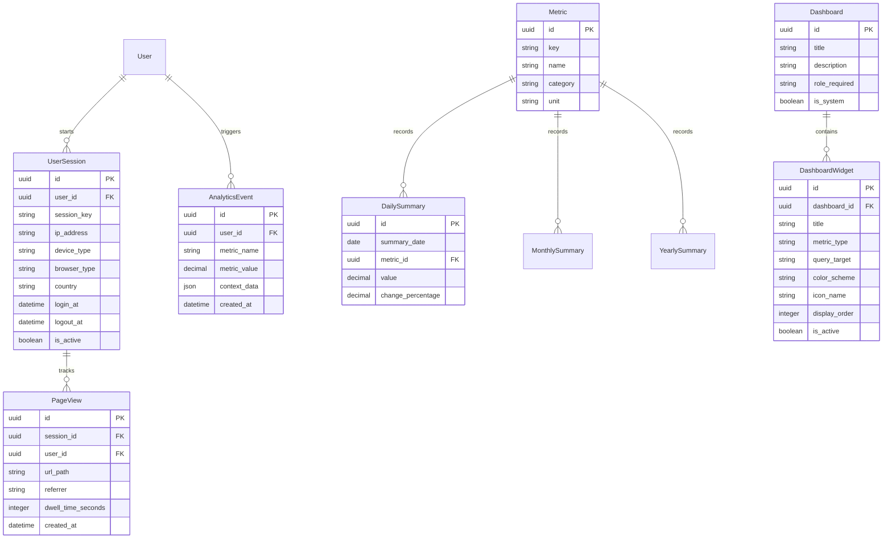

# Database Design Specification: Enterprise Analytics Platform

This document details the database models, fields, constraints, indices, and entity relationships for the Enterprise Analytics Platform.

---

## 1. Entity Relationship (ER) Diagram

The relationships among key analytics, user tracking, reporting, and summarization entities:

---

## 2. Models Specification

### Base Classes
All models extend either `BaseModel` (inherits UUID primary keys and audit fields) or `SoftDeleteModel` (adds soft deletion state `deleted_at`).

---

### 1. Telemetry & User Session Models

#### `AnalyticsEvent` (Extends `BaseModel`)
High-velocity raw logs tracking individual system events.
* `user`: `ForeignKey` to `users.User`, nullable.
* `metric_name`: `CharField(max_length=100)`, indexed.
* `metric_value`: `DecimalField(max_digits=15, decimal_places=4)`.
* `context_data`: `JSONField(default=dict)`.

#### `UserSession` (Extends `SoftDeleteModel`)
Aggregated metrics representing user sessions.
* `user`: `ForeignKey` to `users.User`.
* `session_key`: `CharField(max_length=255, unique=True)`.
* `ip_address`: `CharField(max_length=45)`.
* `device_type`: `CharField(max_length=50)`.
* `browser_type`: `CharField(max_length=50)`.
* `country`: `CharField(max_length=100)`.
* `login_at`: `DateTimeField(auto_now_add=True)`.
* `logout_at`: `DateTimeField(null=True)`.
* `is_active`: `BooleanField(default=True)`.

#### `PageView` (Extends `BaseModel`)
User navigation tracking logs.
* `session`: `ForeignKey` to `UserSession`.
* `user`: `ForeignKey` to `users.User`, nullable.
* `url_path`: `CharField(max_length=500)`, indexed.
* `referrer`: `CharField(max_length=500, null=True)`.
* `dwell_time_seconds`: `IntegerField(default=0)`.

---

### 2. Module Performance Metrics

#### `CourseAnalytics` (Extends `BaseModel`)
LMS module progression rates.
* `course_id`: `UUIDField(unique=True)`.
* `total_enrollments`: `IntegerField(default=0)`.
* `active_students`: `IntegerField(default=0)`.
* `completion_count`: `IntegerField(default=0)`.
* `average_progress`: `DecimalField(max_digits=5, decimal_places=2)`.
* `average_score`: `DecimalField(max_digits=5, decimal_places=2)`.

#### `ArticleAnalytics` (Extends `BaseModel`)
CMS post traffic analytics.
* `article_id`: `UUIDField(unique=True)`.
* `views_count`: `IntegerField(default=0)`.
* `shares_count`: `IntegerField(default=0)`.
* `likes_count`: `IntegerField(default=0)`.
* `comments_count`: `IntegerField(default=0)`.

#### `SearchAnalytics` (Extends `BaseModel`)
Search analytics records (extending search module schemas).
* `query_string`: `CharField(max_length=255, unique=True)`.
* `total_queries`: `IntegerField(default=0)`.
* `total_results`: `IntegerField(default=0)`.
* `click_through_rate`: `DecimalField(max_digits=5, decimal_places=4)`.

#### `NotificationAnalytics` (Extends `BaseModel`)
Notifications delivery rates.
* `notification_id`: `UUIDField(unique=True)`.
* `total_delivered`: `IntegerField(default=0)`.
* `total_opened`: `IntegerField(default=0)`.
* `total_clicked`: `IntegerField(default=0)`.

#### `WalletAnalytics` (Extends `BaseModel`)
Wallet points metrics.
* `wallet_id`: `UUIDField(unique=True)`.
* `total_credits`: `DecimalField(max_digits=15, decimal_places=4)`.
* `total_debits`: `DecimalField(max_digits=15, decimal_places=4)`.
* `net_balance`: `DecimalField(max_digits=15, decimal_places=4)`.
* `transaction_count`: `IntegerField(default=0)`.

#### `RevenueAnalytics` (Extends `BaseModel`)
Financial conversions metrics.
* `date`: `DateField(unique=True)`.
* `total_sales`: `IntegerField(default=0)`.
* `gross_revenue`: `DecimalField(max_digits=15, decimal_places=2)`.
* `refund_count`: `IntegerField(default=0)`.
* `refund_amount`: `DecimalField(max_digits=15, decimal_places=2)`.
* `net_revenue`: `DecimalField(max_digits=15, decimal_places=2)`.

---

### 3. Report & Dashboards Specifications

#### `Report` (Extends `SoftDeleteModel`)
Compiled exports metadata.
* `title`: `CharField(max_length=200)`.
* `description`: `TextField()`.
* `file_path`: `CharField(max_length=500)`.
* `format`: `CharField(max_length=10)`.
* `status`: `CharField(max_length=20, default='PENDING')`.
* `query_params`: `JSONField(default=dict)`.
* `generated_by`: `ForeignKey` to `users.User`.

#### `Dashboard` (Extends `SoftDeleteModel`)
Admin grids metadata.
* `title`: `CharField(max_length=100)`.
* `description`: `TextField()`.
* `role_required`: `CharField(max_length=100)`.
* `is_system`: `BooleanField(default=False)`.

#### `DashboardWidget` (Extends `SoftDeleteModel`)
Widget panels details.
* `dashboard`: `ForeignKey` to `Dashboard`.
* `title`: `CharField(max_length=100)`.
* `metric_type`: `CharField(max_length=30)`.
* `query_target`: `CharField(max_length=255)`.
* `color_scheme`: `CharField(max_length=50)`.
* `icon_name`: `CharField(max_length=50)`.
* `display_order`: `IntegerField(default=0)`.
* `is_active`: `BooleanField(default=True)`.

#### `KPI` (Extends `SoftDeleteModel`)
Administrative targets tracker.
* `name`: `CharField(max_length=100)`.
* `metric_key`: `CharField(max_length=100)`.
* `current_value`: `DecimalField(max_digits=15, decimal_places=4)`.
* `target_value`: `DecimalField(max_digits=15, decimal_places=4)`.
* `status`: `CharField(max_length=20)`.

#### `Metric` (Extends `SoftDeleteModel`)
Primary metrics descriptions catalog.
* `key`: `CharField(max_length=100, unique=True)`.
* `name`: `CharField(max_length=150)`.
* `category`: `CharField(max_length=50)`.
* `unit`: `CharField(max_length=20)`.
* `description`: `TextField()`.

---

### 4. Summary & Job Schedulers

#### `DailySummary` (Extends `BaseModel`)
Calculated daily totals.
* `summary_date`: `DateField()`, indexed.
* `metric`: `ForeignKey` to `Metric`.
* `value`: `DecimalField(max_digits=15, decimal_places=4)`.
* `change_percentage`: `DecimalField(max_digits=7, decimal_places=4)`.

#### `MonthlySummary` (Extends `BaseModel`)
Calculated monthly totals.
* `summary_month`: `DateField()`.
* `metric`: `ForeignKey` to `Metric`.
* `value`: `DecimalField(max_digits=15, decimal_places=4)`.
* `change_percentage`: `DecimalField(max_digits=7, decimal_places=4)`.

#### `YearlySummary` (Extends `BaseModel`)
Calculated yearly totals.
* `summary_year`: `IntegerField()`.
* `metric`: `ForeignKey` to `Metric`.
* `value`: `DecimalField(max_digits=15, decimal_places=4)`.
* `change_percentage`: `DecimalField(max_digits=7, decimal_places=4)`.

#### `RealtimeCounter` (Extends `BaseModel`)
Cached live counters.
* `counter_key`: `CharField(max_length=150, unique=True)`.
* `current_count`: `IntegerField(default=0)`.
* `last_updated_at`: `DateTimeField(auto_now=True)`.

#### `ExportJob` (Extends `SoftDeleteModel`)
Export tasks tracker.
* `job_type`: `CharField(max_length=50)`.
* `status`: `CharField(max_length=20, default='PENDING')`.
* `file_url`: `CharField(max_length=500, null=True)`.
* `error_message`: `TextField(null=True)`.
* `request_payload`: `JSONField(default=dict)`.

#### `ReportSchedule` (Extends `SoftDeleteModel`)
Automated reports schedules.
* `report_title`: `CharField(max_length=200)`.
* `frequency`: `CharField(max_length=20)`.
* `recipients`: `JSONField(default=list)`.
* `next_run_at`: `DateTimeField()`.
* `is_active`: `BooleanField(default=True)`.

#### `AuditAnalytics` (Extends `BaseModel`)
Security mutations counters.
* `audit_date`: `DateField(unique=True)`.
* `total_mutations`: `IntegerField(default=0)`.
* `error_mutations`: `IntegerField(default=0)`.
* `unauthorized_attempts`: `IntegerField(default=0)`.

#### `SystemMetrics` (Extends `BaseModel`)
Hardware load logs.
* `cpu_usage_pct`: `DecimalField(max_digits=5, decimal_places=2)`.
* `memory_usage_pct`: `DecimalField(max_digits=5, decimal_places=2)`.
* `disk_usage_pct`: `DecimalField(max_digits=5, decimal_places=2)`.
* `active_connections`: `IntegerField(default=0)`.
* `api_response_time_avg`: `DecimalField(max_digits=10, decimal_places=4)`.
