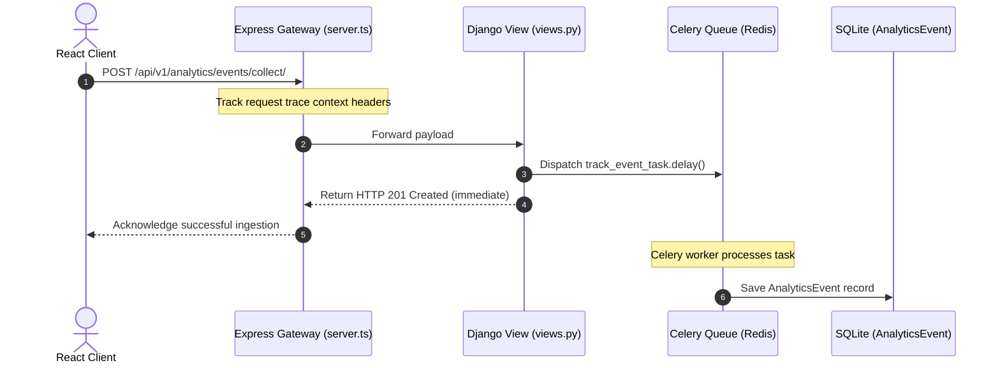
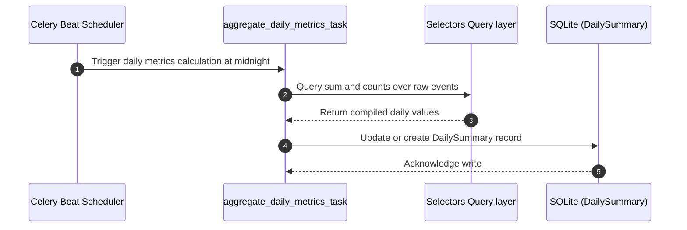
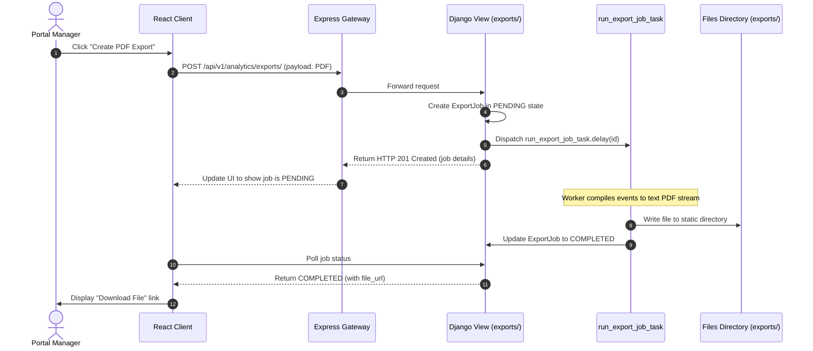

# BrahmaVidya Analytics: Sequence Diagrams

This document maps execution sequences for key analytics processes.

---

## 1. Event Telemetry Pipeline

---

## 2. Daily Metrics Aggregation

---

## 3. On-Demand File Exporter

