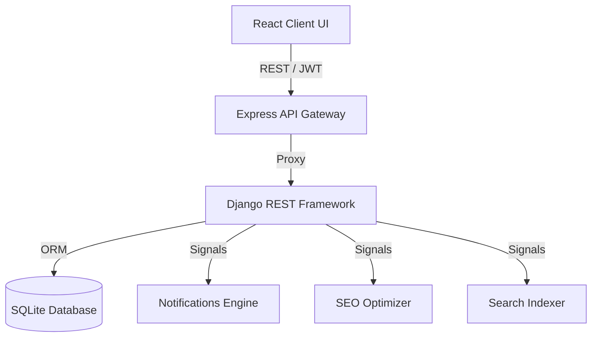

# CMS Architecture Specification

## 1. Architectural Map

## 2. Key Modules
- **Client Side**: Uses `cmsApi.ts` for unified communications. React dispatcher routes requests.
- **API Gateway**: Uses `server.ts` path mappings for proxy routing.
- **Django Core**: Models configure DB constraints. Serializers enforce validation. Custom permissions restrict routes.
