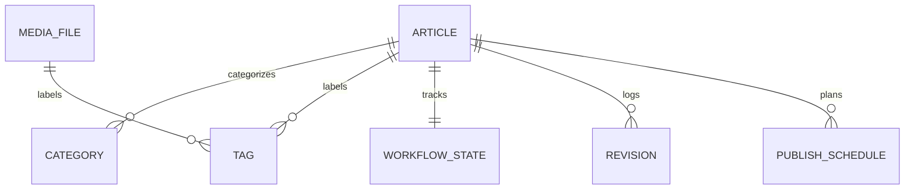

# CMS Database Design

## 1. Database Schema Mappings

## 2. Table Schemas
- **cms_article**: Stores uuid, title, body, status, author, is_published, and timestamps.
- **cms_category**: Stores hierarchy tree elements (name, slug, parent, display_order).
- **cms_tag**: Stores name, slug, usage_count.
- **cms_workflowstate**: Stores current state status, assigned reviewer, and target article.
- **cms_publishschedule**: Stores target publication date, type, id, and schedule executor.
- **cms_mediafile**: Stores uploader user, caption, alt_text, and path locations.
