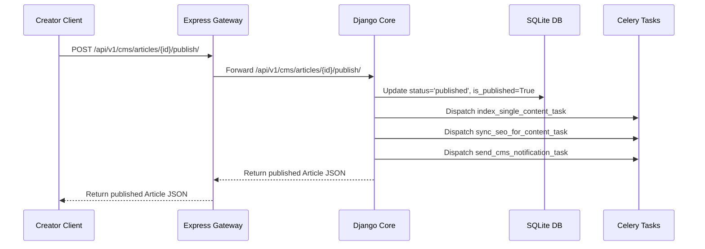

# CMS Sequence Diagrams

## 1. Article Publication & Integration Flow

```mermaid
sequenceDiagram
    participant User as Creator Client
    participant API as Express Gateway
    participant Backend as Django Core
    participant DB as SQLite DB
    participant Tasks as Celery Tasks
    
    User->>API: POST /api/v1/cms/articles/{id}/publish/
    API->>Backend: Forward /api/v1/cms/articles/{id}/publish/
    Backend->>DB: Update status='published', is_published=True
    Backend->>Tasks: Dispatch index_single_content_task
    Backend->>Tasks: Dispatch sync_seo_for_content_task
    Backend->>Tasks: Dispatch send_cms_notification_task
    Backend-->>API: Return published Article JSON
    API-->>User: Return published Article JSON
```
