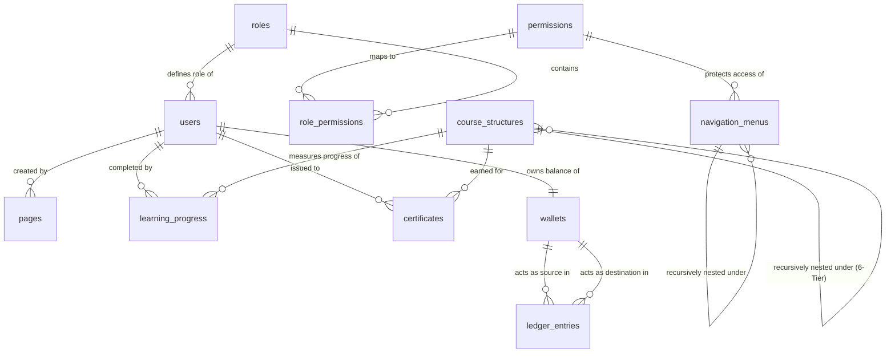

# PostgreSQL Database Architecture Specification

This document details the PostgreSQL database design, data schemas, normalization structures, and transaction strategies for **BrahmaVidya Galaxy**. It serves as the physical and conceptual blueprint for database administrators and backend engineers.

---

## 1. Entity-Relationship (ER) Diagram

The system employs a multi-tenant, recursive database structure. Standard relational constraints (3NF) secure identity, RBAC, and ledger records, while dynamic arrays (JSONB) store CMS layout blocks and LMS metadata.



### 1.1 Structural Relationships List
- **`roles` ↔ `users`**: One-to-Many. Every user belongs to exactly one role.
- **`roles` ↔ `permissions`**: Many-to-Many via the `role_permissions` bridge table.
- **`navigation_menus` ↔ `navigation_menus`**: One-to-Many (Self-Referential). Represents arbitrary nested parent-child menu trees.
- **`course_structures` ↔ `course_structures`**: One-to-Many (Self-Referential). Dictates the recursive 6-tier educational ladder.
- **`users` ↔ `learning_progress` ↔ `course_structures`**: Junction tracking completion percentage (`0.00%` - `100.00%`) for any student on any structural course node.
- **`users` ↔ `certificates` ↔ `course_structures`**: Certifications issued to users upon finishing courses, secured via dynamic cryptographic signature hashes.
- **`users` ↔ `wallets`**: One-to-One. Every user owns exactly one digital wallet tracking balance ledger changes.
- **`wallets` ↔ `ledger_entries`**: One-to-Many (Double-Entry). A transaction tracks currency routing from a source wallet to a target wallet.

---

## 2. Naming Conventions

To guarantee consistency, cleanliness, and ease of automated tooling, the database adheres to these explicit naming rules:

- **Tables**: Pluralized, lowercase, and snake_case (e.g., `navigation_menus`, `ledger_entries`).
- **Columns**: Lowercase, snake_case (e.g., `is_published`, `display_order`).
- **Primary Keys**: Explicitly named `id` for every table.
- **Foreign Keys**: Named as the singular table name with an `_id` suffix (e.g., `role_id` referencing `roles.id`).
- **Indexes**: Prefixed with `idx_` followed by the target table and columns (e.g., `idx_users_email`).
- **Unique Constraints**: Prefixed with `uq_` followed by the table and column name (e.g., `uq_pages_slug`).
- **Foreign Key Constraints**: Prefixed with `fk_` followed by the referencing table and column (e.g., `fk_users_role_id`).
- **Timestamps**: Suffixed with `_at` (e.g., `created_at`, `updated_at`, `deleted_at`).

---

## 3. UUID Strategy

BrahmaVidya Galaxy uses **UUIDv4 (Universally Unique Identifiers)** for all primary keys instead of auto-incrementing integers.

### 3.1 Justification
1. **Security**: Sequential IDs (e.g., `/api/users/1`) expose metadata, facilitating enumeration attacks. UUIDs (e.g., `/api/users/9b1deb4d-3b7d-4bad-9bdd-2b0d7b3dcb6d`) are cryptographically unguessable.
2. **Multi-Tenant Partitioning**: Facilitates offline record generation, easy database scaling, and painless data merging from multiple staging clusters.
3. **Database Portability**: Simplifies synchronization with external tools.

### 3.2 Implementation Strategy
- The database registers the native `uuid-ossp` or `pgcrypto` extension.
- Column defaults use the SQL function `gen_random_uuid()` (standard in PostgreSQL 13+) or `uuid_generate_v4()`.

---

## 4. Key Management: Primary & Foreign Keys

### 4.1 Primary Keys
- Every table enforces a single `id` column declared as `UUID PRIMARY KEY DEFAULT gen_random_uuid()`.
- Composite primary keys are strictly prohibited. Bridge tables (like `role_permissions`) enforce a unique composite index across reference columns but preserve a singular `id` for ORM compatibility.

### 4.2 Foreign Keys
- All foreign keys must match the type of the target primary key (`UUID`).
- Constraints are explicitly named to simplify debugging during database operations.
- **Cascade Deletion Policy**:
  - Critical metadata dependencies (e.g., deleting a parent course node) cascades deletion (`ON DELETE CASCADE`) to child nodes (modules, lessons, tasks) to prevent orphaned records.
  - Core identities (e.g., deleting a user) do NOT cascade to ledger transactions or certificate tables; instead, they trigger soft deletes or set reference values to null (`ON DELETE SET NULL`) to protect financial history.

---

## 5. Audit Strategy

To guarantee strict compliance and facilitate security forensics, the database tracks changes at two distinct layers: **Operational Stamps** and **System Activity Ledgers**.

### 5.1 Operational Stamps (Column Level)
Every table contains these metadata columns:
- `created_at`: TIMESTAMP WITH TIME ZONE DEFAULT CURRENT_TIMESTAMP.
- `updated_at`: TIMESTAMP WITH TIME ZONE DEFAULT CURRENT_TIMESTAMP.
- `created_by`: UUID (Nullable, referencing `users.id` for tracing user actions).
- `updated_by`: UUID (Nullable, referencing `users.id`).

An automated database trigger synchronizes `updated_at` timestamps on write updates:
```sql
CREATE OR REPLACE FUNCTION trigger_set_timestamp()
RETURNS TRIGGER AS $$
BEGIN
  NEW.updated_at = NOW();
  RETURN NEW;
END;
$$ LANGUAGE plpgsql;
```

### 5.2 System Activity Log Ledger
Crucial mutations (e.g., modifying permissions, re-routing financial wallet balances, deleting courses) publish record changes to an immutable audit table:
- **`system_audit_logs`**:
  - `id` (UUID, PK)
  - `actor_id` (UUID referencing `users.id`)
  - `action_type` (VARCHAR, e.g., "ROLE_MODIFIED", "WITHDRAWAL_AUTHORIZED")
  - `target_table` (VARCHAR, e.g., "role_permissions")
  - `before_state` (JSONB) -- Snapshot representation before update
  - `after_state` (JSONB) -- Snapshot representation after update
  - `ip_address` (VARCHAR)
  - `created_at` (TIMESTAMP WITH TIME ZONE)

---

## 6. Soft Delete Strategy

Accidental deletions in an educational system can wipe out student transcripts, completion analytics, or financial balance paths. Thus, the database implements a unified **Soft Delete Strategy**.

### 6.1 Column-Level Flags
Tables supporting soft deletes include:
- `deleted_at`: TIMESTAMP WITH TIME ZONE (Default: NULL).

If `deleted_at` is populated, the record is treated as deleted by application workflows.

### 6.2 Application Query Filters
- **Default Reads**: Application GET API calls automatically append the SQL constraint `WHERE deleted_at IS NULL`.
- **Unique Value Constraints**: Standard unique indexes (e.g., unique email accounts) use conditional rules to allow re-registration of soft-deleted entries:
```sql
CREATE UNIQUE INDEX uq_users_email ON users(email) WHERE deleted_at IS NULL;
```
- **Physical Cleanups**: Purging routines (e.g., cron workers) archive or physically drop records older than 90 days from the soft-delete queue.

---

## 7. Schema & Content Versioning Strategy

To manage modifications safely across active deployments, BrahmaVidya Galaxy implements structured schema and dynamic layout content versioning.

### 7.1 Schema Versioning (DB Migrations)
- **Tooling**: Node.js/TypeScript uses **Drizzle ORM** (or Django Migrations for Python).
- **Pipeline Constraints**:
  - Every schema adjustment creates an immutable, timestamped migration file (e.g., `0012_add_seo_keywords.sql`).
  - Migration files are stored in version control (`/src/db/migrations/`).
  - Schema changes are executed transactionally, automatically rolling back to previous states if error signals occur.

### 7.2 Content Versioning (CMS Layouts & Syllabus Blocks)
To support rolling back site modifications or course content revisions, pages and syllabi utilize revision histories:
- **`content_revisions`**:
  - `id` (UUID, PK)
  - `entity_type` (VARCHAR, e.g., "PAGE", "SYLLABUS")
  - `entity_id` (UUID) -- ID of the target page or course_structure
  - `version_number` (INTEGER, sequential increment)
  - `payload` (JSONB) -- Complete snapshot of layout_data or metadata configuration
  - `created_by` (UUID referencing `users.id`)
  - `created_at` (TIMESTAMP WITH TIME ZONE)

---

## 8. Indexing Strategy

To ensure sub-200ms API responses under peak loads, indexes are optimized for relational filters, self-referential traversals, and dynamic JSONB search patterns.

### 8.1 Relational Indexes
- B-Tree indexes are generated automatically for all primary keys (`id`) and unique constraint keys (e.g., `slug`).
- B-Tree indexes are explicitly added on foreign keys (`role_id`, `parent_id`) to accelerate table joins.

### 8.2 JSONB Document Indexes (Generalized Inverted Index - GIN)
Since dynamic page blocks are stored in JSONB formats inside the database, traditional B-Tree indexes cannot index them. We use PostgreSQL GIN indexes to accelerate search queries inside layout objects:
```sql
-- Speeds up queries querying specific layout block properties (e.g., checking block types)
CREATE INDEX idx_pages_layout_gin ON pages USING gin (layout_data);

-- Speeds up search queries filtering custom syllabus configuration parameters
CREATE INDEX idx_course_metadata_gin ON course_structures USING gin (metadata);
```

### 8.3 Conditional & Partial Indexes
To maintain small index footprints, we leverage partial indexing constraints:
```sql
-- Indexes only active dynamic pages, ignoring drafts or deactivated pages
CREATE INDEX idx_pages_active_slug ON pages(slug) WHERE is_published = TRUE AND deleted_at IS NULL;

-- Indexes only incomplete student transcripts to accelerate active course dashboard views
CREATE INDEX idx_learning_progress_active ON learning_progress(user_id, progress_percentage) WHERE progress_percentage < 100.00;
```
