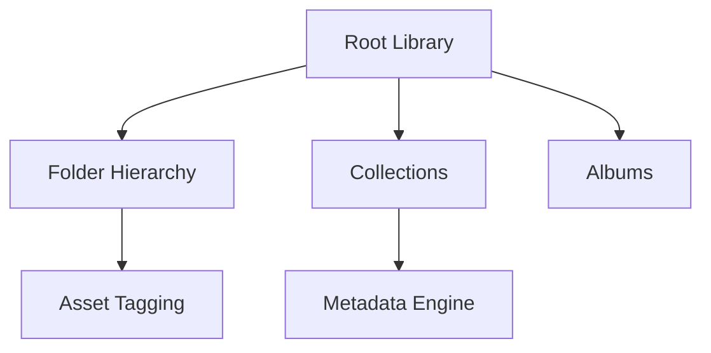
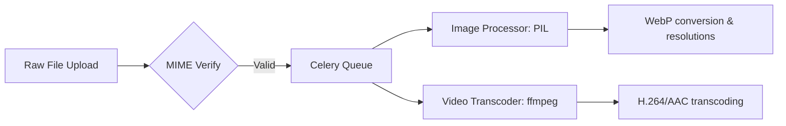

# Enterprise DAM Architecture Design

This document details the system architecture design for the BrahmaVidya Galaxy Enterprise Digital Asset Management (DAM) system.

---

## 1. Modular Hierarchy & Taxonomy

### A. Folder Hierarchy
- Implemented via a `Folder` model supporting self-referential nested parents (`parent_id`) to structure physical assets recursively.

### B. Collections & Albums
- **Collections**: Logical groupings crossing multiple folders (e.g. "Marketing Assets" or "Course Handouts").
- **Albums**: Ordered presentation slides (primarily for images/video showcases).

### C. Tagging & Metadata Engine
- Extends standard tags to support key-value structured EXIF/IPTC metadata properties (e.g. camera, geo-coordinates, copyright tags).

---

## 2. Media Processing Pipeline

Every upload is processed asynchronously using Celery task workers:

- **Thumbnail Generation**: Automatically builds 3 size resolutions (Small 150x150, Medium 600x600, Large 1200x1200).
- **Image Optimization & WebP**: Compresses JPEG/PNG inputs into optimized WebP formats.
- **Video Transcoding**: Invokes FFMPEG to output standard web-friendly MP4 (H.264/AAC codec) profiles.

---

## 3. Storage Abstraction Layer

The system decouples files from physical drives using Django's file storage interface:

- **Local Storage**: Fallback for dev environments.
- **Cloud Storage (S3 / GCS / Azure)**: Managed using `django-storages` with configurations pointing to target endpoints (AWS S3, Google Cloud Storage, or Azure Blob).
- **CDN Layer**: Serves cached assets using CloudFront/Cloudflare.

---

## 4. Versioning & Governance

- **Versioning**: Saves file iterations inside a `MediaVersion` table, allowing developers to track modifications or rollback changes.
- **Approval Workflow**: Uploaded files go through an review status cycle (Pending, Approved, Rejected) before they are marked as public.
- **Trash & Restore Checkpoint**: Soft-delete matches files with `deleted_at` markers. The user can view trash folders and restore elements.
