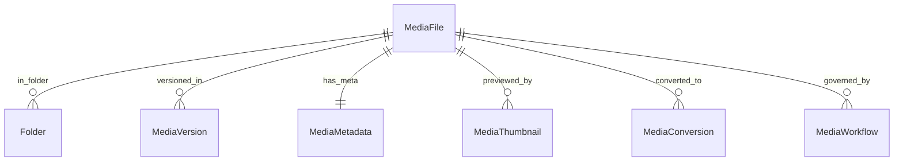

# Enterprise DAM Database Design

This document describes the updated database schemas and entities mapping the Enterprise Digital Asset Management (DAM) subsystem.

---

## 1. Schema Relationships

---

## 2. Table Specifications

### A. Folder (`cms_folders`)
- `id`: UUID (Primary Key)
- `name`: VarChar(255)
- `parent_id`: UUID (Self-referencing parent folder)

### B. MediaCollection (`cms_media_collections`)
- `id`: UUID (Primary Key)
- `name`: VarChar(255)
- `description`: Text
- `user_id`: ForeignKey (`users.User`)

### C. MediaVersion (`cms_media_versions`)
- `id`: UUID (Primary Key)
- `media_file_id`: ForeignKey (`cms_media_files`)
- `file`: FileField path
- `version_number`: Integer (default 1)
- `created_by_id`: ForeignKey (`users.User`)

### D. MediaMetadata (`cms_media_metadata`)
- `id`: UUID (Primary Key)
- `media_file_id`: OneToOneField (`cms_media_files`)
- `metadata_json`: JSONField (containing EXIF/IPTC tags)

### E. MediaWorkflow (`cms_media_workflows`)
- `id`: UUID (Primary Key)
- `media_file_id`: ForeignKey (`cms_media_files`)
- `status`: VarChar (Choice: `pending`, `approved`, `rejected`)
- `assigned_to_id`: ForeignKey (`users.User`)
- `notes`: Text
