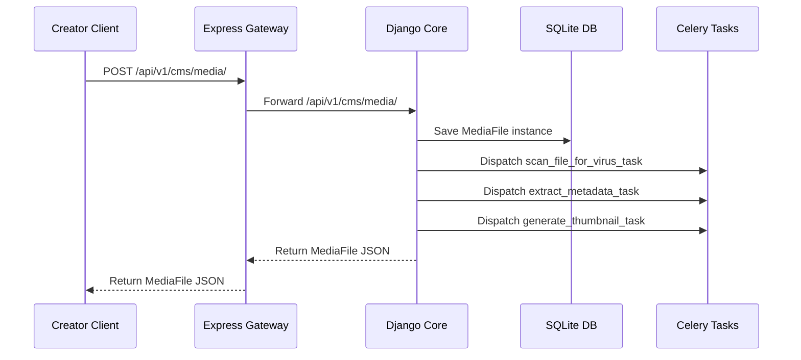

# Enterprise DAM Sequence Diagrams

## 1. Asset Upload & Automated Pipeline Flow

```mermaid
sequenceDiagram
    participant User as Creator Client
    participant API as Express Gateway
    participant Backend as Django Core
    participant DB as SQLite DB
    participant Tasks as Celery Tasks
    
    User->>API: POST /api/v1/cms/media/
    API->>Backend: Forward /api/v1/cms/media/
    Backend->>DB: Save MediaFile instance
    Backend->>Tasks: Dispatch scan_file_for_virus_task
    Backend->>Tasks: Dispatch extract_metadata_task
    Backend->>Tasks: Dispatch generate_thumbnail_task
    Backend-->>API: Return MediaFile JSON
    API-->>User: Return MediaFile JSON
```
