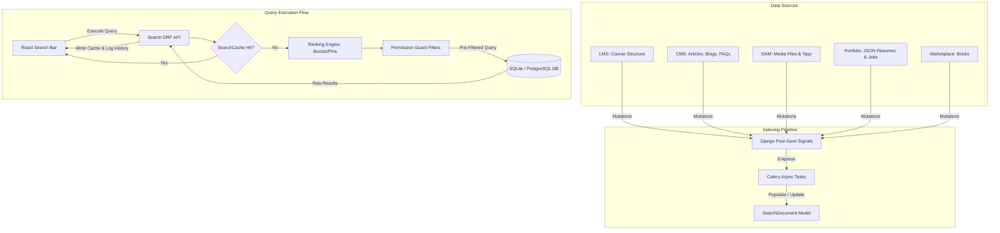

# BrahmaVidya Galaxy: Enterprise Search Architecture

This architecture document details the design specifications for the BrahmaVidya Galaxy Unified Enterprise Search Platform (Sprint 17). It connects the core data modules (LMS, CMS, DAM, Marketplace, Resume/Jobs, Portfolios, Notifications, and Audits) into a single, performant search system.

---

## 1. System Architecture Overview

The Enterprise Search Platform uses an **asynchronous event-driven indexing** pattern combined with a **faceted query engine** containing relevance rankings, caching, and access controls.



---

## 2. Global Search & Module Search

### Global Search
Unified interface that query-dispatches across all indices. It queries `SearchDocument` records where `is_published=True`, executing a multi-field check on `title`, `excerpt`, `body`, and `tags`. Results are returned as a polymorphic collection grouped or ordered by ranking scores.

### Module Search
Targeted search constrained to a specific index namespace. The query is restricted by the `SearchIndex` foreign key or `entity_type` (e.g. `entity_type='CourseStructure'` for courses, `entity_type='MediaFile'` for media).

---

## 3. Autocomplete, Suggestions & Search History

### Autocomplete & Prefix Match
Provides instant suggestions as users type in the query bar.
- **Mechanism:** Prefix matching (`istartswith` or PostgreSQL `tsvector` prefix searches) against `SearchSuggestion` phrases.
- **Ranking:** Suggestions are sorted by `weight` desc, showing highly clicked or trending words first.

### Search Suggestions (Typeahead/Did You Mean?)
Suggests corrections or relevant query alternatives.
- **Mechanism:** If a search query yields zero or low results, the engine calculates the Levenshtein distance between the query and active `SearchTerm` words to propose alternate spelling suggestions.

### Recent, Popular & Trending Searches
- **Recent Searches:** Retrieved from `SearchHistory` filtered by the authenticated user's ID, sorted by `-searched_at`. Limited to 10 entries.
- **Popular Searches:** Retrieved from `SearchTerm` records sorted by `-frequency`.
- **Trending Searches:** Calculated inside `SearchAnalytics` based on query velocity. It calculates search counts in the past 24 hours compared against a baseline to surface breakout topics.

---

## 4. Faceted Filters & Ranking Engine

### Faceted Filters
Enables dynamic sidebar filters (e.g. filtering by Price, Difficulty, Tags, Content-Type).
- **Metadata-Driven Facets:** Mapped inside the `SearchFacet` configurations. Facet values are calculated on database query execution by aggregating properties stored in `SearchDocument.meta_data` (e.g., using Django's JSONField queries).
- **Dynamic Count Aggregation:** Group by and count distinct fields dynamically during search execution to return facets alongside counts:
  ```python
  # Example return structure
  facets = {
      "categories": {"LMS": 12, "Coding": 5},
      "level": {"Beginner": 8, "Advanced": 9}
  }
  ```

### Ranking Engine
Calculates the final search relevance score (`relevance_score`) using lexical matching and custom metrics:

$$Score = (MatchScore \times LexicalWeight) + BoostScore + PinWeight$$

1. **MatchScore (Lexical):** Calculated using word occurrences. Matches in `title` are weighted highest (e.g., multiplier of 3.0), followed by `tags` (2.0), `excerpt` (1.5), and `body` (1.0).
2. **BoostScore:** Added from query matching in `SearchRanking`. Allows administrators to boost specific search documents by query term.
3. **PinWeight:** Documents marked `is_pinned` for a matching query term are forced to the top (virtual infinite score boost).
4. **CTR Factor:** Adjusts rankings based on user selection logs (`SearchClick` feedback loops).

---

## 5. Module Indexing Strategies

### LMS (Course Search)
- **Source Model:** `CourseStructure`
- **Fields:** `title`, `description` -> indexed into `title` and `body`.
- **Metadata Facets:** `node_type` (Subject, Course, Chapter, Lesson), difficulty levels, duration, and author details from JSON metadata.

### CMS (Blog, Tutorial, Article Search)
- **Source Models:** `Article`, `Blog`, `Tutorial`, `FAQ`
- **Fields:** `title`, `excerpt`, `body` indexed directly.
- **Metadata Facets:** `content_type` (article, blog, FAQ), `category`, tags, and author profile details.

### DAM (Media Search)
- **Source Model:** `MediaFile`
- **Fields:** File title, classification properties, and tags.
- **Metadata Facets:** File extension (WebP, PDF, MP4), folder hierarchies, size classes, and collections.

### Jobs, Resumes & Portfolios Search
- **Source Data:** Managed via the JSON file storage `portfolio_store.json`.
- **Fields:**
  - **Portfolio:** website `name`, page layouts, section contents.
  - **Resume:** job history, skills list, summary profiles.
  - **Jobs:** requirements, title, company descriptions.
- **Metadata Facets:** Location, tags, salary scale, theme style, and experience tags.

### Marketplace Search
- **Source Model:** `Book` (from the publishing app).
- **Fields:** Book title, category, descriptions, and publisher references.
- **Metadata Facets:** Price range, publisher, reading progress levels, and author profile identifiers.

### Notification Search
- **Source Model:** `Notification` (from the users app).
- **Fields:** Notification title and verb description.
- **Metadata Facets:** Read status, notification type, and timestamp scope.

### Audit Search
- **Source Models:** `CMSAuditTrail`, `MediaAudit`.
- **Fields:** Action description, actor UUID, change log.
- **Metadata Facets:** Log type, execution request ID, and date ranges. Restricted to platform administrators.

---

## 6. Security & Permission-Aware Search

Search result visibility must honor object-level permissions to prevent private information disclosure.

1. **Draft Exclusions:** Exclude items where `is_published=False` unless the requesting user has edit rights for the target scope.
2. **RBAC Filtering:** Gated by user roles. Anonymous users cannot query documents indexing premium LMS courses or restricted organization records.
3. **CBAC Filtering:** Integrates checks with `ContentPermission` and `MediaPermission` entries:
   - For restricted CMS articles/pages, pre-filter by matching user groups or access codes.
   - For restricted DAM files, query `MediaPermission` checking if the user has read access before returning matches.
4. **Admin Scope:** System logs (`AuditTrail`, `SearchAnalytics`) are restricted via middleware checks to users with administrative roles (`is_staff` or specific administrative capabilities).

---

## 7. Search Analytics & Caching

### Search Analytics
- **Aggregation:** A Celery background worker periodically groups logs in `SearchHistory` and clicks in `SearchClick` to compile aggregations inside `SearchAnalytics`.
- **CTR Engine:** Measures clicks at specific search result positions. Low-relevance queries (high searches, low click CTR) are flagged for synonym additions or manual pins.

### Caching Strategy
- **Caching Mechanism:** Caches query result lists in `SearchCache` keyed by the MD5 hash of parameters: `hash(query_string + filters + page)`.
- **Cache Invalidation:**
  - Standard time-to-live (TTL) expiration of 15 minutes.
  - Signal-based active invalidation: When a mutation is made (e.g. article updated, course published), the index manager clears all related search caches matching the changed entity namespace.

---

## 8. Search API Endpoint Specification

All search API routes map under `/api/v1/search/...` inside DRF ViewSets:

### 1. Unified Search Endpoint
- **URL:** `GET /api/v1/search/query/`
- **Parameters:**
  - `q`: Query string
  - `index`: Index filter scope (optional)
  - `facets`: Comma-separated list of facet variables to aggregate (optional)
  - `page`: Page index
- **Response:**
  ```json
  {
    "results": [
      {
        "id": "uuid-doc-1",
        "title": "Introduction to Python Programming",
        "excerpt": "A foundational course on syntax...",
        "url_path": "/lms/courses/python-intro",
        "entity_type": "CourseStructure",
        "relevance_score": 4.5,
        "meta_data": {
          "level": "Beginner",
          "duration_hours": 12
        }
      }
    ],
    "facets": {
      "level": {
        "Beginner": 1,
        "Advanced": 0
      }
    },
    "page_info": {
      "current_page": 1,
      "total_pages": 5,
      "total_results": 25
    }
  }
  ```

### 2. Autocomplete Endpoint
- **URL:** `GET /api/v1/search/autocomplete/`
- **Parameters:** `q` (current input string)
- **Response:**
  ```json
  {
    "suggestions": ["python basics", "python array", "python object orientation"]
  }
  ```

### 3. Analytics Clicks Logging
- **URL:** `POST /api/v1/search/click/`
- **Request Body:**
  ```json
  {
    "history_id": "uuid-history-entry",
    "document_id": "uuid-search-document",
    "position": 1
  }
  ```
- **Response:** `{"status": "recorded"}`
