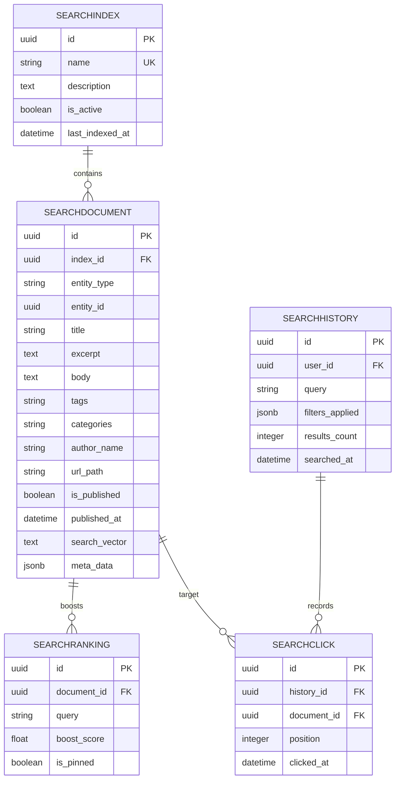

# Enterprise Search Database Design

This document details the database schema and layout for the Unified Enterprise Search Platform in the BrahmaVidya Galaxy ecosystem. The design implements unified search indices, analytics tracking, click-through optimization, suggestions, synonym expansion, and caching.

---

## 1. Entity Relationship Overview

The search database is modular and built entirely around standard Django `BaseModel` (UUID primary keying).

---

## 2. Table Schemas & Models

### 1. `SearchIndex` (db_table: `search_indexes`)
Defines namespaces/indices to partition document sets (e.g. course catalogs, articles, books, files).
- **`name`** (`CharField`, unique): Index classifier.
- **`description`** (`TextField`, nullable): Narrative scope.
- **`is_active`** (`BooleanField`): Toggle query inclusion.
- **`last_indexed_at`** (`DateTimeField`, nullable): Track scheduler indexing status.

### 2. `SearchDocument` (db_table: `search_documents`)
The central document corpus. Replaces individual table scans by storing metadata, URLs, and search vector snippets.
- **`index`** (`ForeignKey` to `SearchIndex`): Index scoping.
- **`entity_type`** (`CharField`, indexed): E.g., `Article`, `CourseStructure`.
- **`entity_id`** (`UUIDField`, indexed): Original record UUID.
- **`title`** (`CharField`): Search title text.
- **`excerpt`** (`TextField`): Short description summary.
- **`body`** (`TextField`): Deep text search corpus.
- **`tags`** (`CharField`): Space-separated list of tags.
- **`categories`** (`CharField`): Comma-separated categories.
- **`author_name`** (`CharField`): Document author context.
- **`url_path`** (`CharField`): Relative web router URL link.
- **`is_published`** (`BooleanField`): Controls dynamic lookup exclusions.
- **`published_at`** (`DateTimeField`): Publication date sequencing.
- **`search_vector`** (`TextField`): Token/lexeme tokens list.
- **`meta_data`** (`JSONField`): Dynamic fields (e.g., pricing, status, complexity, language) powering facets and filters.
- **Constraints/Indexes:**
  - Unique Constraint: `uq_search_document_index_entity` on `(index, entity_type, entity_id)`
  - Index: `idx_search_doc_entity` on `(entity_type, entity_id)`
  - Index: `idx_search_doc_pub_status` on `(is_published, published_at)`

### 3. `SearchTerm` (db_table: `search_terms`)
Aggregates queries entered by users to identify search trends.
- **`term`** (`CharField`, unique): The normalized search text.
- **`frequency`** (`PositiveIntegerField`): Search counters.
- **`last_queried_at`** (`DateTimeField`): Timestamp update flag.

### 4. `SearchAnalytics` (db_table: `search_analytics`)
Stores aggregated analytics metrics for search quality evaluations.
- **`query_string`** (`CharField`, unique): Normalized query.
- **`total_queries`** (`PositiveIntegerField`): Sum queries run.
- **`total_results`** (`PositiveIntegerField`): Matches count history.
- **`click_through_rate`** (`FloatField`): Percentage of sessions with a click.
- **`avg_dwell_time`** (`FloatField`): Time (seconds) spent on clicked results.

### 5. `SearchHistory` (db_table: `search_histories`)
Individual logs of users executing query strings.
- **`user`** (`ForeignKey` to `users.User`, nullable): Query author.
- **`query`** (`CharField`): Searched string.
- **`filters_applied`** (`JSONField`): Active search parameters.
- **`results_count`** (`PositiveIntegerField`): Matched records returned.
- **`searched_at`** (`DateTimeField`): Search execution timestamp.

### 6. `SearchSuggestion` (db_table: `search_suggestions`)
Powers typeahead autocomplete and query correction.
- **`phrase`** (`CharField`, unique): Auto-suggest text.
- **`weight`** (`FloatField`): Recommendation rank.
- **`is_active`** (`BooleanField`): Suggested status.

### 7. `SearchRanking` (db_table: `search_rankings`)
Allows query boost scoring or top-pinning documents.
- **`document`** (`ForeignKey` to `SearchDocument`): Targeted result.
- **`query`** (`CharField`): Matching search phrase trigger.
- **`boost_score`** (`FloatField`): Rank booster score.
- **`is_pinned`** (`BooleanField`): Pin flag override.
- **Constraints/Indexes:**
  - Unique Constraint: `uq_search_ranking_doc_query` on `(document, query)`
  - Index: `idx_search_rank_query` on `(query)`

### 8. `SearchClick` (db_table: `search_clicks`)
Captures click events mapping queries to results.
- **`history`** (`ForeignKey` to `SearchHistory`): Session link.
- **`document`** (`ForeignKey` to `SearchDocument`): Clicked item.
- **`position`** (`PositiveIntegerField`): Visual rank index (1-based).
- **`clicked_at`** (`DateTimeField`): Selection timestamp.

### 9. `SearchFacet` (db_table: `search_facets`)
Metadata definition layout for search filters.
- **`name`** (`CharField`, unique): Human readable facet label.
- **`field_name`** (`CharField`): JSON key mapping inside metadata.
- **`is_active`** (`BooleanField`): Active filter config.

### 10. `SearchSynonym` (db_table: `search_synonyms`)
Synonym mappings supporting query expansion.
- **`term`** (`CharField`, unique): Search term.
- **`synonyms`** (`TextField`): Comma-separated equivalence list.
- **`is_active`** (`BooleanField`): Synonym mapping status.

### 11. `SearchCache` (db_table: `search_caches`)
Lowers search request latency.
- **`query_key`** (`CharField`, unique): MD5 hash of parameters.
- **`results_json`** (`JSONField`): Serialized document list.
- **`expires_at`** (`DateTimeField`): Expiry check parameter.

---

## 3. Database Migration Run

Migrations generated under `backend/apps/search/migrations/0001_initial.py` compile:
1. `SearchIndex` config layout mapping to `SearchDocument` relationships.
2. Logging structures (`SearchHistory` -> `SearchClick`).
3. Relevance controllers (`SearchRanking`, `SearchSynonym`).
4. Operational tables (`SearchCache`, `SearchSuggestion`).
