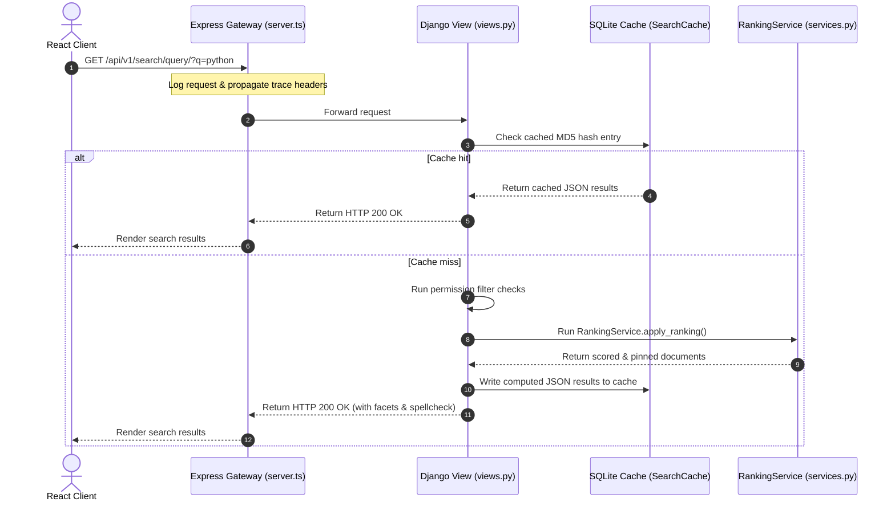
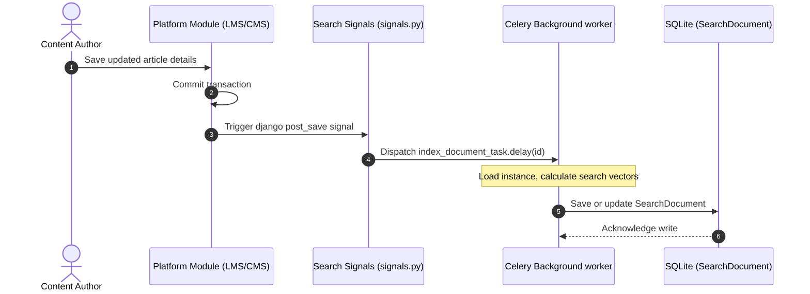
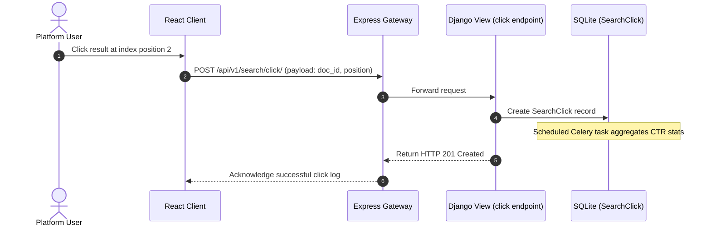

# BrahmaVidya Search: Sequence Diagrams

This document maps sequence execution routes for key search platform procedures.

---

## 1. Search Query Lifecycle

---

## 2. Real-Time Indexing Pipeline

---

## 3. Click Tracking CTR Feedback Loop

