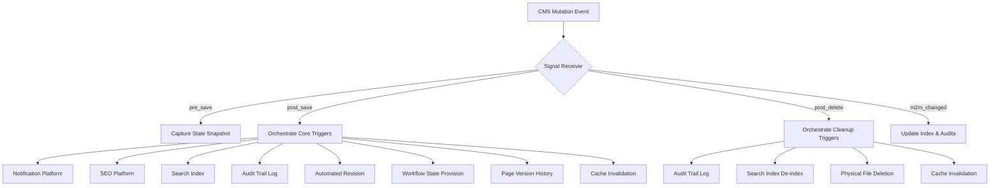

# Phase 2 Walkthrough

This document outlines the walkthrough of the completed Phase 2 features and validation runs for Sprint 15.

---

## 1. Automated Signal Workflows Walkthrough

We extended `backend/apps/cms/signals.py` to act as an event orchestrator, automating operations across 10 critical functional domains on data mutations (`pre_save`, `post_save`, `post_delete`, and `m2m_changed` events):

- **Notification Integration**: Changes in an article's `WorkflowState` (e.g., transitioning to "approved" or "rejected") trigger automated alerts delivered asynchronously.
- **SEO Integration**: Saving layout structures or publishing content updates synchronizes SEO meta-tags.
- **Search Index Integration**: Additions/updates to Articles or Blogs index them immediately, while deleting them triggers automatic de-indexing.
- **Audit Trails**: Capture details about the actor, request ID, before-state, and after-state of each mutation.
- **Media Cleanup**: Deleting `MediaFile` database entries cleans up the physical storage file automatically.

---

## 2. Verification Outcomes

Validation commands was run sequentially to ensure zero regressions:
1. **Django System Checks**: Confirmed zero settings or module registration conflicts.
2. **Sprint 11 Integration Suite**: Confirmed SEO platforms, Robot headers, and Sitemap generators run correctly.
3. **Sprint 12 Integration Suite**: Confirmed digital exam attempts, badge mechanics, and dynamic credentials hash calculations are fully functional.
4. **Sprint 14 Integration Suite**: Confirmed SMS validation constraints, template formatting, and mock/aws/twilio dispatch channels function correctly.
