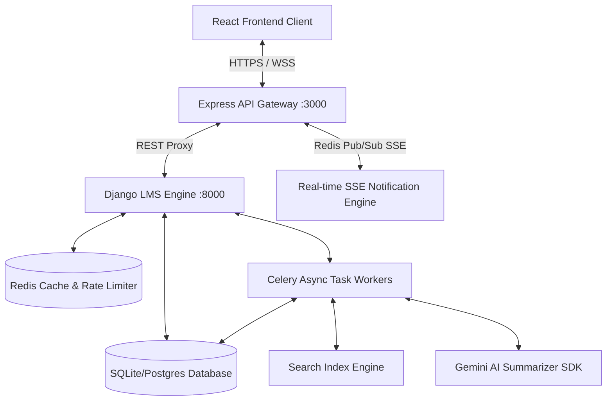

# BrahmaVidya Galaxy — Live Classes Platform Architecture Design
**Sprint 22 — Phase 1: High-Performance Architecture Blueprint**

This document designs the complete, production-ready architecture for the **Live Classes Platform**, outlining model extensions, real-time gateways, streaming states, background workers, and the specific module designs.

---

## 1. System Architecture Diagram

---

## 2. Infrastructure & Integrations Architecture

### 2.1. Backend Architecture
*   **Domain Decoupling**: Build extensions inside the existing Django `apps/lms` module (as defined in [backend/apps/lms/models.py](file:///c:/Users/USER/Downloads/bramhavi%20(3)/backend/apps/lms/models.py)).
*   **Service Layer Orchestrator**: The [LiveClassService](file:///c:/Users/USER/Downloads/bramhavi%20(3)/backend/apps/lms/services.py#L49) acts as the entrypoint for scheduling, activation, closure, and participation logging.
*   **WebRTC/RTMP Signaling Integration**: Use Jitsi Meet API / Twilio Room integrations mapping room session allocations to the database. Jitsi is the primary target due to open WebRTC room structure mapping directly to the `stream_url` and `meeting_id`.
*   **State Machine Transitions**:
    *   `SCHEDULED` (Initial state on creation)
    *   `LIVE` (Transitioned on `start-session` action; boots [LiveSession](file:///c:/Users/USER/Downloads/bramhavi%20(3)/backend/apps/lms/models.py#L614))
    *   `COMPLETED` (Transitioned on `end-session` action; triggers background tasks)

### 2.2. Frontend Architecture
*   **Context Layer (`LiveClassRoomContext.tsx`)**: Reusable state mapping details:
    *   `activeParticipants`: Map of user IDs to room roles.
    *   `muteState` / `cameraState`: Toggles for stream status.
    *   `handRaiseQueue`: Sorted stack tracking students asking questions.
    *   `whiteboardCanvas`: Active drawings serialization cache.
*   **Style Adaptation**: Fully inherits dark-mode custom styling HSL properties defined in [DesignSystem.tsx](file:///c:/Users/USER/Downloads/bramhavi%20(3)/src/components/DesignSystem.tsx).
*   **API Client**: Reuses the centralized client wrappers inside [liveApi.ts](file:///c:/Users/USER/Downloads/bramhavi%20(3)/src/services/liveApi.ts).

### 2.3. Database Architecture
All models are defined in [backend/apps/lms/models.py](file:///c:/Users/USER/Downloads/bramhavi%20(3)/backend/apps/lms/models.py):

1.  **`LiveClass`**: Schedules interactive streaming lectures.
    *   `id`: UUID (Primary Key)
    *   `course`: ForeignKey to `CourseStructure`
    *   `teacher`: ForeignKey to `users.User`
    *   `title`: CharField
    *   `scheduled_at`: DateTimeField
    *   `duration_minutes`: IntegerField
    *   `stream_url`: CharField
    *   `status`: CharField (`SCHEDULED`, `LIVE`, `COMPLETED`)
    *   `meeting_id`: CharField (External WebRTC room channel ID)
2.  **`LiveSession`**: Tracks runtime instances of live broadcasts.
    *   `id`: UUID
    *   `live_class`: ForeignKey to `LiveClass`
    *   `started_at`: DateTimeField
    *   `ended_at`: DateTimeField (nullable)
    *   `is_active`: BooleanField
3.  **`MeetingParticipant`**: Logs viewer participation status.
    *   `id`: UUID
    *   `live_class`: ForeignKey to `LiveClass`
    *   `user`: ForeignKey to `users.User`
    *   `role`: CharField (`PRESENTER`, `ATTENDEE`)
    *   `joined_at`: DateTimeField
    *   `left_at`: DateTimeField (nullable)
4.  **`Recording`**: Stores archived video assets.
    *   `live_class`: ForeignKey to `LiveClass`
    *   `video_url`: URLField
    *   `file_size_bytes`: BigIntegerField
    *   `duration_seconds`: IntegerField
5.  **`Whiteboard`**: Collaborative canvas coordinate maps.
    *   `live_class`: ForeignKey to `LiveClass`
    *   `canvas_data`: TextField (JSON coordinate array)
6.  **`ChatMessage`**: Persistent live chat logs.
    *   `live_class`: ForeignKey to `LiveClass`
    *   `sender`: ForeignKey to `users.User`
    *   `message`: TextField
    *   `timestamp`: DateTimeField
7.  **`Poll`**: Instructor questions.
    *   `live_class`: ForeignKey to `LiveClass`
    *   `creator`: ForeignKey to `users.User`
    *   `question`: TextField
    *   `is_anonymous`: BooleanField
    *   `is_active`: BooleanField
8.  **`PollOption`**: Mapped answer selections.
    *   `poll`: ForeignKey to `Poll`
    *   `option_text`: CharField
9.  **`PollVote`**: Learner answer selections.
    *   `poll`: ForeignKey to `Poll`
    *   `option`: ForeignKey to `PollOption`
    *   `voter`: ForeignKey to `users.User` (nullable)
10. **`BreakoutRoom`**: Decoupled sub-room configurations.
    *   `live_class`: ForeignKey to `LiveClass`
    *   `name`: CharField
    *   `meeting_id`: CharField
11. **`CalendarEvent`**: Syncs course calendar records.
    *   `user`: ForeignKey to `users.User`
    *   `live_class`: ForeignKey to `LiveClass`
    *   `event_title`: CharField
    *   `start_time`: DateTimeField
    *   `end_time`: DateTimeField
12. **`Reminder`**: Schedule logs for notification alerts.
    *   `user`: ForeignKey to `users.User`
    *   `live_class`: ForeignKey to `LiveClass`
    *   `remind_at`: DateTimeField
    *   `is_sent`: BooleanField
13. **`MeetingAnalytics`**: Telemetry summaries of ended classes.
    *   `live_class`: ForeignKey to `LiveClass`
    *   `total_participants`: IntegerField
    *   `average_engagement_score`: FloatField
    *   `peak_concurrent_users`: IntegerField

### 2.4. REST API & Gateway Architecture
The API Gateway ([server.ts](file:///c:/Users/USER/Downloads/bramhavi%20(3)/server.ts)) proxies client requests from `/api/v1/live/*` to the Django server endpoint `/api/v1/lms/*`.

| Endpoint | Method | Payload | Success Response (200 OK) | Role Required |
| :--- | :--- | :--- | :--- | :--- |
| `/api/live-classes/` | `GET` | None | `Array<LiveClass>` | Authenticated |
| `/api/live-classes/` | `POST` | `Course, Title, ScheduledAt, Duration` | `LiveClass` | TEACHER / ADMIN |
| `/api/live-classes/{id}/start-session/` | `POST` | None | `LiveSession` | TEACHER (Owner) |
| `/api/live-classes/{id}/end-session/` | `POST` | None | `LiveClass` | TEACHER (Owner) |
| `/api/live-classes/{id}/record-attendance/` | `POST` | `joined_at, left_at` | `MeetingParticipant` | Authenticated |
| `/api/live-classes/{id}/create-poll/` | `POST` | `question, options: []` | `Poll` | TEACHER (Owner) |
| `/api/chat-messages/` | `GET` | `live_class_id` | `Array<ChatMessage>` | Enrolled Student / Instructor |
| `/api/chat-messages/` | `POST` | `live_class, message` | `ChatMessage` | Enrolled Student / Instructor |
| `/api/polls/{id}/vote/` | `POST` | `option_id` | `PollVote` | Enrolled Student |

### 2.5. Redis Usage
*   **Distributed Rate Limiting**: Enforces rate limiting on stream interactions (like chat, hand raise, and voting events) by caching requests counts inside Redis keys (`ratelimit:{token}`).
*   **Presence Management**: Stores active participant counts for live rooms in Redis keys (`liveclass:room:{id}:members`) with an expiry of 60 seconds (extended by polling heartbeats).
*   **Pub/Sub SSE Notifications**: Express Gateway listens to the redis pub/sub channel `notifications_pubsub`. Django emits alerts when a stream starts (`status` changed to `LIVE`), immediately broadcasting payload notifications down to client Server-Sent Events listener connections.

### 2.6. Celery Usage
Tasks are implemented in [backend/apps/lms/tasks.py](file:///c:/Users/USER/Downloads/bramhavi%20(3)/backend/apps/lms/tasks.py):
*   `compile_class_recording_task`: Triggered on stream completion. Queries [MeetingParticipant](file:///c:/Users/USER/Downloads/bramhavi%20(3)/backend/apps/lms/models.py#L628) rows to compute actual watch durations and saves analytics. Mock-uploads completed MP4 assets to cloud storage.
*   `generate_ai_class_summary`: Captures transcript text records and sends compilation prompts to Gemini AI, updating `ai_summary` metadata on `LiveClass`.
*   `alert_upcoming_live_classes`: Background cron execution checking for `SCHEDULED` events starting in the next 30 minutes, enqueueing push alerts to registered users.

### 2.7. Search, Analytics, Notification & AI Integration
*   **Search**: Extends [backend/apps/search/models.py](file:///c:/Users/USER/Downloads/bramhavi%20(3)/backend/apps/search/models.py) indexing logic. A Django post-save signal indexes new `LiveClass` items into `SearchDocument` records (`entity_type='LiveClass'`), allowing students to query upcoming streams.
*   **Analytics**: Emit join/leave event tracking logs to [backend/apps/analytics/models.py](file:///c:/Users/USER/Downloads/bramhavi%20(3)/backend/apps/analytics/models.py#L9) as custom `AnalyticsEvent` metrics.
*   **Notification**: Centralized routing via the `apps/notifications` delivery models. Creates `NotificationRecord` elements linked to user preferences.
*   **AI Integration**: Feeds transcript text blocks to the Gemini client interface defined in [server.ts](file:///c:/Users/USER/Downloads/bramhavi%20(3)/server.ts#L27) and [backend/apps/ai](file:///c:/Users/USER/Downloads/bramhavi%20(3)/backend/apps/ai) to generate structured session lecture notes.

---

## 3. Core Functional Modules Design

### 3.1. Live Dashboard
*   **UI/UX Layout**: Fully implemented inside [LiveDashboard.tsx](file:///c:/Users/USER/Downloads/bramhavi%20(3)/src/components/live/LiveDashboard.tsx#L507). A structured split console showing analytics cards at the top, a scheduling interface for teachers, and active/completed schedules below in a grid.
*   **APIs / Triggers**: Triggers `liveApi.getLiveClasses()` on load. Re-fetches lists via state updates.
*   **State Handling**: Manages loading spinners, active broadcast room displays, and replay modals.
*   **Backend Flow**: Views match requests utilizing `LiveClassViewSet`. Filters classes matching user roles.

### 3.2. Schedule Class
*   **UI/UX Layout**: Integrated [ScheduleClass](file:///c:/Users/USER/Downloads/bramhavi%20(3)/src/components/live/LiveDashboard.tsx#L17) form. Contains course choice selectors, date/time inputs, target stream duration, and action buttons.
*   **APIs / Triggers**: Submits fields to `liveApi.createLiveClass()`.
*   **State Handling**: Toggles loading indicators while verifying parameters and triggers parent component reload on success.
*   **Backend Flow**: Handled by `LiveClassService.schedule_live_class`. Executes timing validators to reject scheduling past dates.

### 3.3. Instant Class
*   **UI/UX Layout**: "Quick Broadcast Launch" button on the Teacher's Dashboard header panel.
*   **APIs / Triggers**: Calls `POST /api/live-classes/` with blank scheduling times, defaulting to immediately active (`status = 'LIVE'`).
*   **State Handling**: Boots a WebRTC session immediately upon receiving the newly created class object.
*   **Backend Flow**: Creates a `LiveClass` record on the fly with `scheduled_at = now()`, immediately spawning a `LiveSession` and returning room tokens.

### 3.4. Join Class
*   **UI/UX Layout**: "Join Classroom" buttons visible under active stream schedules inside the main console.
*   **APIs / Triggers**: Queries student course enrollment capabilities and fetches meeting identifiers.
*   **State Handling**: Gated entry that blocks learners if enrollment status is inactive or course validation fails.
*   **Backend Flow**: Viewset validates user authorization against [student_enrollments](file:///c:/Users/USER/Downloads/bramhavi%20(3)/backend/apps/lms/models.py#L545) before granting WebRTC keys.

### 3.5. Meeting Lobby
*   **UI/UX Layout**: Pre-flight overlay appearing before video connection. Shows device configurations, audio levels, and webcam preview panels.
*   **APIs / Triggers**: Invokes browser devices API checks (`navigator.mediaDevices.enumerateDevices`).
*   **State Handling**: Caches hardware preferences (device IDs) in local state, setting up hardware permissions prior to loading RTC streams.
*   **Backend Flow**: Client-only check; does not hit backend unless fetching session metadata.

### 3.6. Whiteboard
*   **UI/UX Layout**: Interactive canvas element (`Whiteboard` sub-component in [LiveDashboard.tsx](file:///c:/Users/USER/Downloads/bramhavi%20(3)/src/components/live/LiveDashboard.tsx#L134)). Includes color picker widgets, size controls, and canvas resets.
*   **APIs / Triggers**: Translates mouse coordinate movements into JSON path inputs. Saves canvas arrays periodically to the database via `liveApi.saveWhiteboard()`.
*   **State Handling**: Real-time render loop updating coordinates to match broadcasted drawings from the stream host.
*   **Backend Flow**: Commits JSON coordinates to the [Whiteboard](file:///c:/Users/USER/Downloads/bramhavi%20(3)/backend/apps/lms/models.py#L657) database table.

### 3.7. Screen Sharing
*   **UI/UX Layout**: Icon tray toggle button next to stream controls inside [MeetingRoom](file:///c:/Users/USER/Downloads/bramhavi%20(3)/src/components/live/LiveDashboard.tsx#L370).
*   **APIs / Triggers**: Launches native media device request stream via `navigator.mediaDevices.getDisplayMedia({ video: true })`.
*   **State Handling**: Toggles feed window display layouts to present the screen sharing track to the WebRTC peer connections.
*   **Backend Flow**: Handled completely on WebRTC signaling layer; logs event state shifts to stream analytics.

### 3.8. Chat
*   **UI/UX Layout**: Side chat drawer (`Chat` sub-component in [LiveDashboard.tsx](file:///c:/Users/USER/Downloads/bramhavi%20(3)/src/components/live/LiveDashboard.tsx#L208)). Lists user messages with relative timestamps.
*   **APIs / Triggers**: Polling loop calls `liveApi.getChatMessages(liveClassId)`. Sending queries uses `liveApi.sendChatMessage()`.
*   **State Handling**: Dynamically appends chat logs on input, scrolling down the chat drawer container.
*   **Backend Flow**: Saves chat strings linked to users via [ChatMessage](file:///c:/Users/USER/Downloads/bramhavi%20(3)/backend/apps/lms/models.py#L669) entries.

### 3.9. Raise Hand
*   **UI/UX Layout**: Toggle button located on the learner's meeting panel. In the instructor dashboard, raised hands show up as a priority participant queue.
*   **APIs / Triggers**: Emits a telemetry hand-raise state event to the backend/gateway.
*   **State Handling**: Marks the student's local connection state, lighting up visual badges next to the speaker's name in the meeting room list.
*   **Backend Flow**: In-memory Redis flag tracks raised hands in `liveclass:room:{id}:handraises` to avoid hitting SQLite/Postgres disk databases during live interaction.

### 3.10. Attendance
*   **UI/UX Layout**: Sidebar indicator widget showing active participants list (`AttendancePanel` in [LiveDashboard.tsx](file:///c:/Users/USER/Downloads/bramhavi%20(3)/src/components/live/LiveDashboard.tsx#L91)).
*   **APIs / Triggers**: Calls `/api/live-classes/{id}/record-attendance/` at join and leave timestamps.
*   **State Handling**: Automatically triggers dynamic attendance calls on tab focus or closing actions.
*   **Backend Flow**: Maps user connection durations in [MeetingParticipant](file:///c:/Users/USER/Downloads/bramhavi%20(3)/backend/apps/lms/models.py#L628) and syncs logs with the teacher portal's [Attendance](file:///c:/Users/USER/Downloads/bramhavi%20(3)/backend/apps/teacher/models.py#L123) schema.

### 3.11. Polls
*   **UI/UX Layout**: Interactive interactive component (`Polls` inside [LiveDashboard.tsx](file:///c:/Users/USER/Downloads/bramhavi%20(3)/src/components/live/LiveDashboard.tsx#L275)). Renders questions and response option buttons.
*   **APIs / Triggers**: Creators deploy questions via `liveApi.createPoll()`. Users select choices via `liveApi.castVote()`.
*   **State Handling**: Calculates percentages dynamically to present real-time progress bars as votes arrive.
*   **Backend Flow**: Evaluates database votes across [PollOption](file:///c:/Users/USER/Downloads/bramhavi%20(3)/backend/apps/lms/models.py#L698) and [PollVote](file:///c:/Users/USER/Downloads/bramhavi%20(3)/backend/apps/lms/models.py#L710) tables.

### 3.12. Breakout Rooms
*   **UI/UX Layout**: "Split Cohorts" panel inside the Teacher Dashboard. Configures participant divisions and durations.
*   **APIs / Triggers**: Submits partitions to `POST /api/v1/lms/breakout-rooms/`.
*   **State Handling**: Forces redirect updates that push students into designated breakout WebRTC channels.
*   **Backend Flow**: Inserts split details into [BreakoutRoom](file:///c:/Users/USER/Downloads/bramhavi%20(3)/backend/apps/lms/models.py#L723) databases.

### 3.13. Recording
*   **UI/UX Layout**: Recording indicator badge on stream overlay.
*   **APIs / Triggers**: Host session toggles start recording, invoking internal media record setups.
*   **State Handling**: Updates room status flags to denote active recording execution.
*   **Backend Flow**: Triggers background video stream compilation upon completion via the Celery worker task `compile_class_recording_task`.

### 3.14. Replay
*   **UI/UX Layout**: Replay window dialog ([Replay](file:///c:/Users/USER/Downloads/bramhavi%20(3)/src/components/live/LiveDashboard.tsx#L459)) containing video player containers and metadata sheets.
*   **APIs / Triggers**: Triggers `liveApi.getRecordings()` on initialization.
*   **State Handling**: Configures playback source paths, displaying files retrieved from cloud storage.
*   **Backend Flow**: Fetches records from the [Recording](file:///c:/Users/USER/Downloads/bramhavi%20(3)/backend/apps/lms/models.py#L643) model schema.

### 3.15. Calendar
*   **UI/UX Layout**: Calendar board view inside student and teacher profiles.
*   **APIs / Triggers**: Fetches synced schedule arrays through `liveApi.getCalendarEvents()`.
*   **State Handling**: Formats arrays into monthly layouts displaying planned lessons.
*   **Backend Flow**: Syncs scheduler events on new class generation, updating the database table [CalendarEvent](file:///c:/Users/USER/Downloads/bramhavi%20(3)/backend/apps/lms/models.py#L736).

### 3.16. Reminders
*   **UI/UX Layout**: Push updates and in-app alerts showing up in the notification bells dashboard.
*   **APIs / Triggers**: Submits setup preferences via `liveApi.createReminder()`.
*   **State Handling**: Updates user toggles to register client notifications.
*   **Backend Flow**: Logs requests in [Reminder](file:///c:/Users/USER/Downloads/bramhavi%20(3)/backend/apps/lms/models.py#L751), which background Celery workers check periodically.
