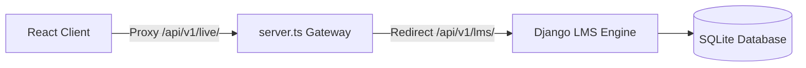

# Live Classes Platform — System Design Specification (SDS)
**Sprint 22 — Phase 9 Documentation**

## 1. System Architecture
The live classroom platform extends the Django `apps/lms` module and integrates with the Node.js API Gateway reverse proxy for unified route delegation.

## 2. Database Models Schema
*   **`live_classes`**: Stores metadata, course associations, status states (`SCHEDULED`, `LIVE`, `COMPLETED`), and stream URLs.
*   **`live_sessions`**: Tracks session active intervals.
*   **`live_meeting_participants`** & `live_attendance`: Log viewer presence duration.
*   **`live_chat_messages`**: Persists in-app classroom chats.
*   **`live_polls`** / `live_poll_options` / `live_poll_votes`: Manages dynamic quizzes.
*   **`live_recordings`**: Records compiled video archives storage locations.

## 3. Real-time Message Flows
*   Drawings coordinates are dispatched as serialised drawing arrays.
*   Chats are written to SQLite via REST routes and cached under Redis keys.
