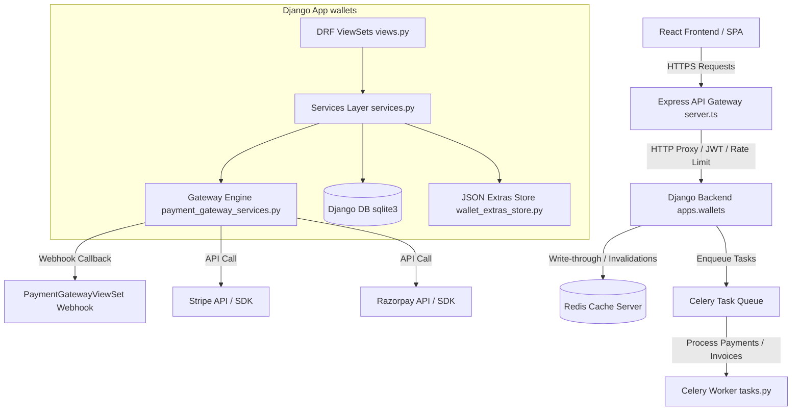

# Payments, Wallet & Subscription Platform — Architecture Design
**Sprint 23 — Phase 1 Design**

This document establishes the architecture for the enterprise-grade Payments, Wallet & Subscription Platform within the BrahmaVidya Galaxy system.

---

## 1. System Topology & Architecture

Below is a system topography diagram showing the data orchestration between the gateway, caching server, task worker, external providers, and database layers:

---

## 2. Platform Architecture Layers

### 2.1. Backend Architecture
*   **Decoupled Domain Layer**: Core logic is encapsulated within service handlers inside `apps.wallets` using transactional blocks (`@transaction.atomic`) to guarantee double-entry accounting.
*   **Security & Gating**: Implements role-based access control (RBAC) permissions (e.g. `IsWalletOwnerOrAdmin` and `IsFinanceOrAdmin` in [permissions.py](file:///c:/Users/USER/Downloads/bramhavi%20(3)/backend/apps/wallets/permissions.py)).

### 2.2. Frontend Architecture
*   **TypeScript Components**: Integrated using React hooks for balance tracking, cart checks, and invoicing.
*   **State Management**: Context-based wallet states that update on actions like checkouts or additions.
*   **Modular Views**: Decoupled dashboards like `TeacherWallet.tsx` and custom checkout overlays in `MarketplaceView.tsx`.

### 2.3. Database Architecture (Entity Relationships)
*   `Wallet` (1-to-1 with `User`): Stores balances and currencies.
*   `Transaction` (Many-to-1 with `Wallet`): Records credits/debits.
*   `Payment` (Many-to-1 with `User`, Many-to-1 with `StudentEnrollment`): Logs external gateway transaction IDs.
*   `Subscription` (Dynamic JSON mapping): Stores tier records, status, and expiration timestamps.
*   `Invoice` (Dynamic JSON mapping): Stores item lists, totals, tax shares, and invoice numbers.

### 2.4. REST API Architecture
Exposed through DRF ViewSets registered inside [urls.py](file:///c:/Users/USER/Downloads/bramhavi%20(3)/backend/apps/wallets/urls.py):
*   `GET /api/v1/wallets/wallets/{id}/balance/`: Inquires active wallet points balance.
*   `POST /api/v1/wallets/wallets/{id}/add-funds/`: Credits funds (admin/finance restricted).
*   `POST /api/v1/wallets/wallets/settle-purchase/`: Debits user wallet and credits teacher/platform.
*   `POST /api/v1/wallets/payment-gateway/create-payment-intent/`: Generates order payloads.
*   `POST /api/v1/wallets/payment-gateway/webhook/`: Handles Stripe/Razorpay webhooks.

### 2.5. Gateway Integration
*   Integrated directly inside Express router path maps in [server.ts](file:///c:/Users/USER/Downloads/bramhavi%20(3)/server.ts#L84-L110) which transparently handles authorization forwarding, request correlations, logging, and rate limiting.

### 2.6. Redis Usage
*   **Caching**: Holds pre-computed metrics and daily earnings summaries inside a dedicated `analytics` cache alias.
*   **State Tracking**: Stores active session validation structures with automated TTL timeouts.

### 2.7. Celery Usage
*   **Asynchronous Tasks**: Compiles PDF invoice sheets, checks daily subscription expiration cycles, and processes monthly creator payout balances.

### 2.8. Platform Sub-system Integrations
*   **Analytics**: Integrated into `RevenueAnalyticsViewSet` reporting aggregate transaction credits and debits.
*   **Notifications**: Triggers multi-channel (email/in-app) alerts on low balances, purchase completions, and invoice dispatches.
*   **Search**: Mapped into the global search index for looking up invoice catalogs.
*   **AI**: Analyzes transaction histories for fraud detection and user spending summaries.

---

## 3. Core Module Specifications

### 3.1. Wallet Dashboard
*   **Scope**: Displays active balances, lifetime earnings, and total commission paid.
*   **Design**: KPI cards synced to `/api/v1/wallets/wallets/{id}/summary/` with loading skeletons.

### 3.2. Transactions
*   **Scope**: Detailed table of transaction histories containing credit/debit filters, transaction classification types (`PURCHASE`, `WITHDRAWAL`, `TRANSFER`), and reference ID lookups.

### 3.3. Subscription Plans
*   **Scope**: Managed plans (Free, Student Premium, Teacher Premium, Institute).
*   **Design**: Serialized pricing charts mapped to feature flags.

### 3.4. User Subscriptions
*   **Scope**: Tracks user memberships, statuses, launch times, and automatic renewals.
*   **Design**: Active user flags checkable via `get_user_subscription`.

### 3.5. Checkout
*   **Scope**: Combines order details, applies coupon codes, and displays GST breakdowns.
*   **Design**: Integrates Stripe Elements/Razorpay SDK modals in `MarketplaceView.tsx`.

### 3.6. Payment Gateway
*   **Scope**: Base gateway provider model (`BasePaymentProvider`) with implementations for Stripe and Razorpay.
*   **Design**: Validates webhook signatures and processes post-transaction captures.

### 3.7. Refund Management
*   **Scope**: Initiates administrative refunds via Stripe/Razorpay captures.
*   **Design**: Logs refund amounts and reasons inside `payment_gateway_extras.json`.

### 3.8. Invoice Management
*   **Scope**: Generates invoice records containing billing details, GST registrations, and serial numbers.
*   **Design**: Auto-calculates totals and updates payment states.

### 3.9. Teacher Earnings
*   **Scope**: Auto-splits purchase settlements, allocating GST (18%) and platforms fees (10%), and crediting instructor wallets.

### 3.10. Withdrawal Requests
*   **Scope**: Handles bank transfers and teacher payouts from wallets.
*   **Design**: Deducts wallet balances and logs audit items.

### 3.11. Revenue Analytics
*   **Scope**: Renders charts of revenue growth, commissions, and transaction metrics.
*   **Design**: Polled via `/api/v1/wallets/revenue-analytics/`.

### 3.12. Coupon Engine
*   **Scope**: Validates code expiry, minimum cart requirements, and percentage/flat discounts.
*   **Design**: Synced to `PlatformSetting` configurations.

### 3.13. Referral Engine
*   **Scope**: Tracks affiliate codes and credits commission wallets for successful recommendations.

### 3.14. GST Calculation
*   **Scope**: Isolates tax-inclusive costs, dividing totals into net pricing and GST taxes.

### 3.15. Payment Audit Logs
*   **Scope**: Records security-sensitive payment actions (refunds, manual adjustments, webhooks) with timestamps and actor emails.
